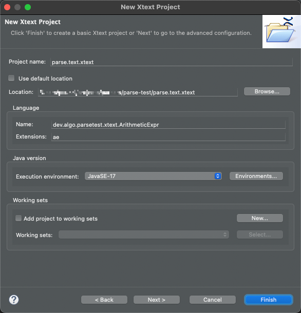
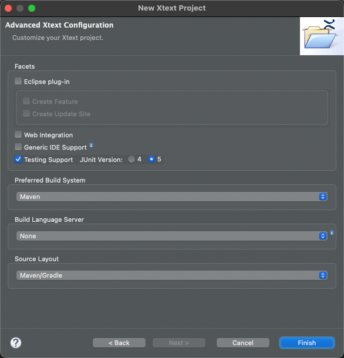

# parse test Xtext Parent


## Xtext project Generation

This project was generate with eclipse, as follows

Cmd+N -> New Xtext Project 

- name: parse.test.xtext
- location: same folder as `parse-test/`
- grammar: dev.algo.parsetest.xtext.ArithmeticExpr
- extension: ae



-> Next, second wizard page.

- checked: only Testing Support
- Build System: Maven
- Layout: Maven/Gradle (results in a hierarchical folder layout)



### Grammar 

```
Model:
	Expression;

Expression returns Expr:
AddSub;

AddSub returns Expr:
//	MultDiv (({Add.left=current} '+' | {Sub.left=current} '-') right=MultDiv)*; // Specific rules
    MultDiv ({AddSub.left=current} ('+' | '-') right=MultDiv)*; // Generic rule

MultDiv returns Expr:
//	Primary (({Mult.left=current} '*' | {Div.left=current} '/') right=Primary)*; // Specific rules
    Primary ({AddSub.left=current} ('*' | '/') right=Primary)*; // Generic rule

Primary returns Expr:
	
    NumberLiteral | '(' AddSub ')';

NumberLiteral returns Expr:
    value=INT;

// Note: see also https://www.typefox.io/blog/parsing-expressions-with-xtext/
```

### MWE2 Workflow changes

```
generator = {
				generateXtendStub = false
				generateJavaMain = true
			}
```


